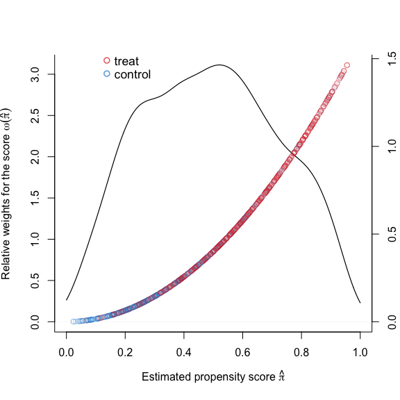

<!-- README.md is generated from README.Rmd. Please edit that file -->

# nawtilus: An R Package for the Navigated Weighting (NAWT)


**nawtilus** provides a procedure for the navigated weighting (NAWT)
proposed by [Katsumata (2020)](https://arxiv.org/abs/2005.10998), which
estimates a pre-specified parameter of interest (e.g., the average
treatment effects or the average treatment effects on the treated) with
the inverse probability weighting where propensity scores are estimated
using estimating equations suitable for the parameter of interest. It
also provides several tools for summarizing and checking the estimation
results, including covariate balance check and an inverse probability
weights plot.

<br>

<!-- badges: start -->

<!-- badges: end -->

## How to cite

<font size="4"> Hiroto Katsumata. 2020. nawtilus: An R package for the
Navigated Weighting. R package version 0.1.1.9000
<https://github.com/hirotokatsumata/nawtilus/> </font>

## Installation

<!--
You can install the released version of nawtilus from [CRAN](https://CRAN.R-project.org) with:

``` r
install.packages("nawtilus")
```

And the development version from [GitHub](https://github.com/) with:
-->

You can install the development version from
[GitHub](https://github.com/) with:

``` r
# install.packages("devtools")
devtools::install_github("hirotokatsumata/nawtilus")
```

## Example

This example shows how to use **nawtilus** for estimation of parameter
of interest.

First, load the package and make toy data.

``` r
# Load the function
library(nawtilus)

# Make toy data
# ATT estimation
# True ATT is 10
tau <- 10
set.seed(12345)
n <- 1000
X <- matrix(rnorm(n * 4, mean = 0, sd = 1), nrow = n, ncol = 4)
prop <- 1 / (1 + exp(X[, 1] - 0.5 * X[, 2] + 0.25 * X[, 3] + 0.1 * X[, 4]))
treat <- rbinom(n, 1, prop)
y <- 210 + 27.4 * X[, 1] + 13.7 * X[, 2] + 13.7 * X[, 3] + 13.7 * X[, 4] + 
     tau * treat + rnorm(n)

# Data frame
df <- data.frame(X, treat, y)
colnames(df) <- c("x1", "x2", "x3", "x4", "treat", "y")
```

Then, specify a model for propensity score estimation.

``` r
formula_c <- as.formula(treat ~ x1 + x2 + x3 + x4)
```

Fit the model for the average treatment effects on the treated (ATT)
estimation using `nawt()` with the default setting (a power weighting
function with α = 2).

``` r
# Power weighting function with alpha = 2
fit <- nawt(formula = formula_c, outcome = "y", estimand = "ATT", 
            method = "score", data = df, alpha = 2)
#> [1] "Estimate weights for the ATT estimation by (weighted) score conditions"
#> [1] 1000
#> [1] 1000
#> [1] 1000
#> [1] 1000
```

You can summarize the results easily with `summary()`.

``` r
summary(fit)
#> 
#> Call: 
#> nawt(formula = formula_c, outcome = "y", estimand = "ATT", method = "score", 
#>     data = df, alpha = 2)
#> 
#> ATT estimates:  10.54
#> 
#> Coefficients:
#>             Estimate Std..Error z.value  Pr...z..    
#> est         10.54356    1.19535  8.8205 0.000e+00 ***
#> (Intercept)  0.01142    0.07642  0.1494 8.812e-01    
#> x1          -1.05398    0.12718 -8.2871 2.220e-16 ***
#> x2           0.43165    0.09211  4.6860 2.786e-06 ***
#> x3          -0.21745    0.08829 -2.4629 1.378e-02   *
#> x4           0.12933    0.09039  1.4308 1.525e-01    
#> ---
#> Signif. codes:  0 '***' 0.001 '**' 0.01 '*' 0.05 '.' 0.1 ' ' 1 
#> 
#> Effective N for the propensity score estimation: 610.16
#> Effective N for the ATT estimation:
#>   treatment: 475 
#>   control:   156.68
```

Check covariate balance between the treatment and control groups before
and after the NAWT with `cbcheck()`.

``` r
oldpar <- par(no.readonly = TRUE) # Just for adjusting plot margins
par(mar = c(5.1, 5.1, 4.1, 2.1)) # Just for adjusting plot margins
cbcheck(fit)
```


``` r
par <- oldpar # Just for adjusting plot margins
```

Let’s compare the inverse probability weights estimated by the nawt with
those estimated by the standard logistic regression with
`plot()`.

``` r
plot(fit)
```


Finally, check the weights used in propensity score estimation and
distribution of the estimated propensity scores in the NAWT with
`plot_onega()`.

``` r
plot_omega(fit)
```


